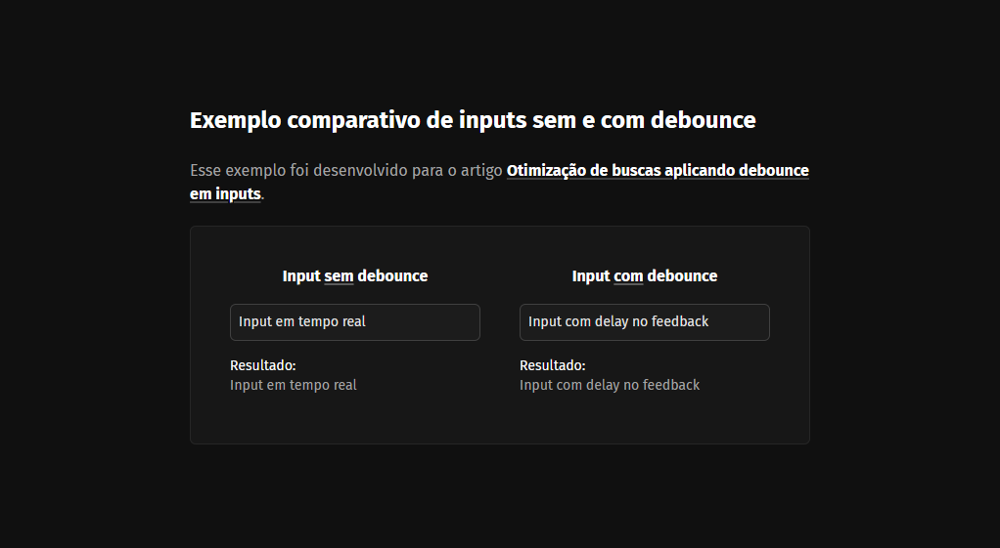

# Input Debounce



Esse projeto foi desenvolvido como material de exemplo para o artigo [Otimização de buscas aplicando debounce em inputs](https://filipedias.dev/blog/otimizacao-de-buscas-aplicando-debounce-em-inputs) no meu blog pessoal.

## Iniciando o projeto

Para executar esse projeto será necessário ter o [Node.js](https://nodejs.org/) e o [pnpm](https://pnpm.io/) instalados.

Instale as dependências:

```bash
pnpm install
```

Execute o servidor de desenvolvimento:

```bash
pnpm dev
```

## Licença

Este projeto está licenciado sob o MIT. Consulte a [licença](LICENSE) para mais informações.
